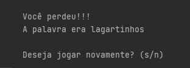

<h1 align="center"> Hangman </h1>

Programação do jogo

## 🎯 Funcionalidades
✔️ O programa permite ao usuário jogar a Forca com alguma palavra sorteada na hora;  
✔️ O programa permite ao usuário jogar quantas vezes desejar;  
✔️ O programa reconhece as repetições de letras, entrada de símbolos e números;  
✔️ O programa atualiza o estado conforme o progresso do jogador;  
✔️ Ao final do jogo, a palavra correta é exibida.

## 🚀 Linguagens
✔️ Foi utilizado Python em todo o projeto.

## 🎨 Layout

       &nbsp; &nbsp; 
       &nbsp; &nbsp; 
      
## ⚖️ Licença
✔️ MIT License.

## 🔥 Sobre mim 
  

  
   
  

